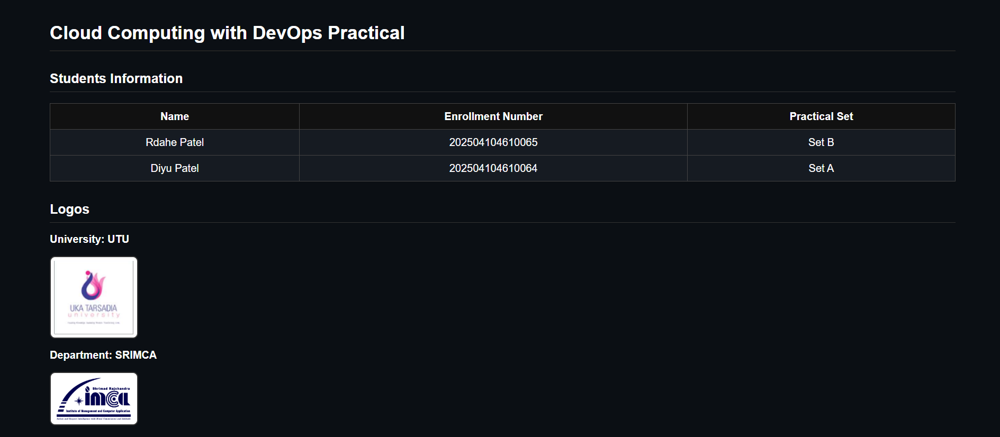
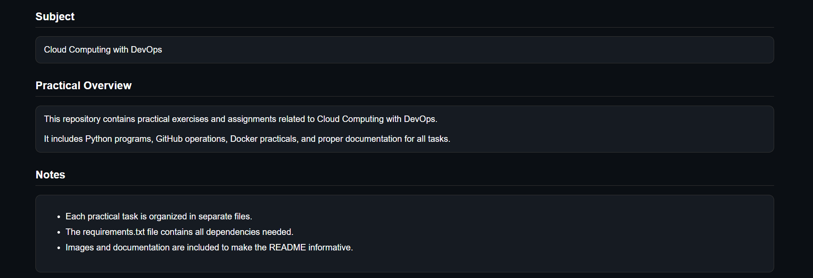

# Practical 5 - Cloud Computing with DevOps

## Objective
Create a functional project with proper HTML documentation including images.

## Steps
1. Open `index.html` in a browser to see logos and practical overview.
2. All images are in the `images/` folder.

## Screenshots

